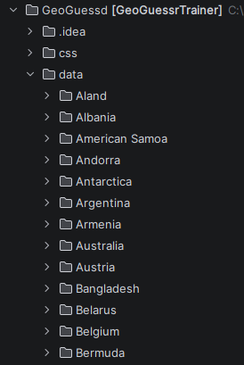

# GeoGuessd - A GeoGuessr Trainer
###### CSCI4166 Project Winter 2026

TODO

## Setup

### 1. Download the code
### 2. Download the data

Since I felt it would have created too many dependencies to automate this step with Python
you will have to manually download the dataset, unzip it, and place it in the `/data/images/` folder.
The dataset can be downloaded as a `.zip` from
[here](https://www.kaggle.com/datasets/ubitquitin/geolocation-geoguessr-images-50k?resource=download).
Please make sure you have enough space to unzip it. Once you have unzipped it, move all the folders
in `/archive/compressed_dataset/` to the `/data/images/` folder in the source code. The directory should look
like this when you've done this:

# Usage
1. You will need to run a local server to display the webpage. There are many ways to do this but the suggested
method is to use WAMP as this is what was used in development.
2. The homepage will display TODO
